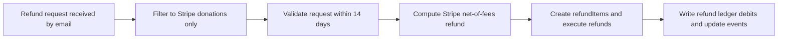

# Crowd-Funding Data Model Scope (Convex + Stripe + Crypto)

## Goal
Define a minimal, production-grade data model and interaction contract for:
1. Card + crypto donations
2. Funding meter milestones (`$10k`, `$50k`, `$100k`)
3. RSS feed rendering of campaign progress and publishing activity
4. Donor self-service donation visibility
5. Refund-all workflow for Stripe donations requested by email within 14 days

## Scope Boundaries
- In scope: schema, entities, indexes, interaction contracts, refund math, feed model.
- Out of scope for MVP:
  - admin analytics depth
  - multi-campaign support
  - advanced KYC tiers

## Payment Rails (modeled)
- `stripe_card`
- `base_eth`, `base_usdc`
- `polygon_eth`, `polygon_usdc`
- `optimism_eth`, `optimism_usdc`
- `ethereum_eth`, `ethereum_usdc`
- `solana_sol`, `solana_usdc`

All rails normalize into a single `donations` ledger in USD cents for meter progression.

## Donor Identity Rules
- Donation is anonymous by default.
- Donor can optionally provide a display name.
- Donor portal supports lookup by donor account or receipt token.

## Milestone Model
- Step 1: `$10,000` -> `1 RTX Pro`
- Step 2: `$50,000` -> `4 RTX Pro`
- Step 3: `$100,000` -> `Dell Pro Max with GB3000`

Milestones are persisted in `fundingMilestones` so they can evolve without schema changes.

## Core Tables
- `campaigns`: campaign state + canonical funded meter cache.
- `fundingMilestones`: threshold definitions and reach timestamps.
- `donors`: donor identity by email/wallet/stripe customer.
- `paymentRails`: enabled card/crypto rails.
- `donations`: canonical donation ledger (card and crypto unified).
- `stripeWebhookEvents`: idempotent raw Stripe webhook ingestion log.
- `refundPolicies`: Stripe net-of-fees policy snapshots.
- `refundBatches`: refund-all jobs for Stripe-eligible donations.
- `refundItems`: per-donation refund execution rows.
- `campaignUpdates`: timeline events used for RSS/public updates.
- `donorAccessSessions`: tokenized access for donor donation views.
- `ledgerEntries`: auditable financial events for totals and reconciliation.

## Critical Indexes
- `campaigns.by_slug`
- `donations.by_campaign_and_status`
- `donations.by_donor_and_created_at`
- `donations.by_receipt_token`
- `refundItems.by_batch_and_status`
- `stripeWebhookEvents.by_event_id`
- `campaignUpdates.by_campaign_and_visibility_and_published_at`

## Interaction Flows

```mermaid
flowchart LR
  A["Donor picks amount"] --> B["Select rail: card or crypto"]
  B --> C["Optional name, anonymous default"]
  C --> D["Create donation intent"]
  D --> E["Provider or chain confirmation"]
  E --> F["Write donation + ledger entries"]
  F --> G["Update campaign meter"]
  G --> H["Emit campaignUpdates event"]
  H --> I["Visible in donor portal and RSS"]
```

## RSS Feed Model
`campaignUpdates` is the source of truth. RSS generation consumes only rows where:
- `visibility = "public"`
- ordered by `publishedAt desc`

Public event classes for MVP:
- `donation_confirmed`
- `milestone_reached`
- `operator_note`
- `publishing_github`
- `publishing_huggingface`

## Refund Rules (MVP)
- Request channel: `sherifcherfa@gmail.com`
- Window: 14 days from donation timestamp
- Rail eligibility: Stripe card only
- Returned amount: original donation minus Stripe-kept fees

Refund policy is snapshotted into `refundBatches` so historical refunds remain auditable if fee settings change.

## Webhook Runtime Wiring
- Convex HTTP route: `POST /stripe-webhook`
- Signature verification: Stripe `v1` HMAC check using `STRIPE_WEBHOOK_SECRET`
- Idempotency anchor: `stripeWebhookEvents.eventId` unique query via `by_event_id`

## Live API Endpoints
- `GET /api/campaign?slug=compute-cluster-fund`
  - Returns campaign meter, milestones, rails, updates, and donations.
- `POST /api/donation-intent`
  - Creates donation intent records in Convex.
  - For `stripe_card`, creates real Stripe PaymentIntent and stores `stripePaymentIntentId`.
- `GET /api/donor-donations?receiptToken=...`
  - Returns donations tied to a public receipt token.
- `GET /rss.xml?slug=compute-cluster-fund`
  - RSS feed built from public `campaignUpdates`.

## Convex + Keys Status
- Data model uses Convex schema and TypeScript contracts in this repo.
- Local credentials are stored in `.env.local` and ignored by git.
- No Convex or Stripe credentials are committed in tracked files.

## Files
- Convex schema: `/Users/sero/ai/fundraiser/convex/schema.ts`
- Contracts: `/Users/sero/ai/fundraiser/fundraising/interfaces.ts`
- Config and milestone constants: `/Users/sero/ai/fundraiser/fundraising/configs.ts`
- Refund math: `/Users/sero/ai/fundraiser/fundraising/helpers/refunds.ts`
- Flow definitions: `/Users/sero/ai/fundraiser/fundraising/logic/interactions.ts`

## Implementation Readiness Checklist
- [x] Unified ledger model for card + crypto
- [x] Meter + milestone thresholds modeled
- [x] Donor visibility model defined
- [x] Refund-all model scoped to Stripe + 14-day window + email request
- [x] RSS source model defined (donations + publishing events)
- [x] Stripe webhook signature verification + event ingestion route modeled
- [ ] Provider adapters (Stripe + EVM + Solana)
- [ ] Stripe event to donation/refund state projection handlers
- [ ] RSS endpoint implementation
- [ ] Auth/session policy implementation
